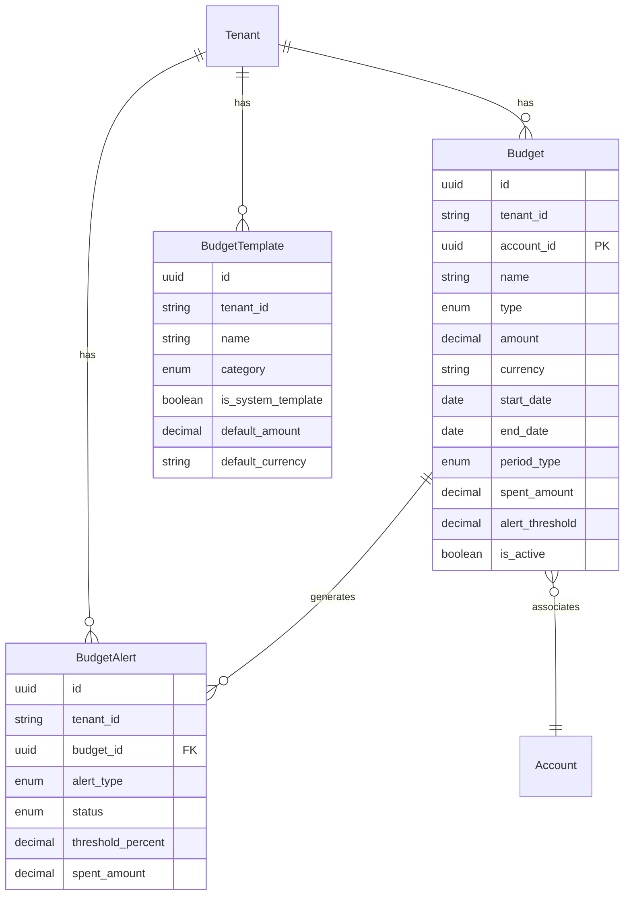

# Budget Management System - Data Model

**Feature**: 006-budget-management-system
**Date**: 2026-01-25

## Entity Overview

```
Tenant (existing)
  ↓
Budget (1) ───→ BudgetAlert (many)
Budget (1) ───→ BudgetTemplate (many, via tenant)
Account (optional, many-to-one) ← Budget
```

---

## Budget Entity

### TypeORM Definition

```typescript
// backend/src/budgets/entities/budget.entity.ts

@Entity('budgets')
export class Budget {
  @PrimaryGeneratedColumn('uuid')
  id: string;

  @Column()
  tenant_id: string;

  @Column({ nullable: true })
  account_id: string | null;

  @Column({ length: 200 })
  name: string;

  @Column({
    type: 'enum',
    enum: BudgetType,
  })
  type: BudgetType;

  @Column({ type: 'decimal', precision: 20, scale: 4 })
  amount: number;

  @Column({ length: 10 })
  currency: string;

  @Column({ type: 'date' })
  start_date: Date;

  @Column({ type: 'date', nullable: true })
  end_date: Date | null;

  @Column({
    type: 'enum',
    enum: PeriodType,
    nullable: true,
  })
  period_type: PeriodType | null;

  @Column({ type: 'decimal', precision: 20, scale: 4, default: 0 })
  spent_amount: number;

  @Column({ length: 10, default: 'USD' })
  spent_currency: string;

  @Column({ type: 'decimal', precision: 3, scale: 2, nullable: true })
  alert_threshold: number;

  @Column({ default: true })
  is_active: boolean;

  @CreateDateColumn()
  created_at: Date;

  @UpdateDateColumn()
  updated_at: Date;

  @DeleteDateColumn()
  deleted_at: Date | null;
}
```

### Enums

```typescript
export enum BudgetType {
  PERIODIC = 'periodic',
  NON_PERIODIC = 'non_periodic',
}

export enum PeriodType {
  MONTHLY = 'monthly',
  WEEKLY = 'weekly',
  YEARLY = 'yearly',
}
```

### Validation Rules

| Field | Rule | Reason |
|-------|------|--------|
| `name` | Required, 1-200 chars | UX readability, database constraint |
| `amount` | Required, > 0 | Financial integrity |
| `currency` | Required, valid ISO 4217 | Multi-currency support |
| `start_date` | Required | Budget period start |
| `end_date` | Optional, > start_date | Limited duration budgets |
| `alert_threshold` | Optional, 0-1 | Percentage threshold |
| `period_type` | Required if type=periodic | Periodic budget type |

### Indexes

```sql
CREATE INDEX idx_budgets_tenant_active 
  ON budgets(tenant_id, is_active);

CREATE INDEX idx_budgets_tenant_type 
  ON budgets(tenant_id, type, period_type);

CREATE INDEX idx_budgets_account 
  ON budgets(account_id) WHERE account_id IS NOT NULL;
```

---

## BudgetAlert Entity

### TypeORM Definition

```typescript
// backend/src/budgets/entities/budget-alert.entity.ts

@Entity('budget_alerts')
export class BudgetAlert {
  @PrimaryGeneratedColumn('uuid')
  id: string;

  @Column()
  tenant_id: string;

  @Column()
  budget_id: string;

  @Column({
    type: 'enum',
    enum: AlertType,
  })
  alert_type: AlertType;

  @Column({
    type: 'enum',
    enum: AlertStatus,
    default: AlertStatus.PENDING,
  })
  status: AlertStatus;

  @Column({ type: 'decimal', precision: 5, scale: 2 })
  threshold_percent: number;

  @Column({ type: 'decimal', precision: 20, scale: 4 })
  spent_amount: number;

  @Column({ type: 'decimal', precision: 20, scale: 4 })
  budget_amount: number;

  @Column({ length: 10 })
  currency: string;

  @Column({ type: 'text', nullable: true })
  message: string;

  @Column({ nullable: true })
  user_id: string;

  @Column({ type: 'timestamp', nullable: true })
  sent_at: Date;

  @Column({ type: 'timestamp', nullable: true })
  acknowledged_at: Date;

  @CreateDateColumn()
  created_at: Date;
}
```

### Enums

```typescript
export enum AlertType {
  BUDGET_WARNING = 'budget_warning',
  BUDGET_EXCEEDED = 'budget_exceeded',
  BUDGET_DEPLETED = 'budget_depleted',
  BUDGET_PERIOD_END = 'budget_period_end',
}

export enum AlertStatus {
  PENDING = 'pending',
  SENT = 'sent',
  ACKNOWLEDGED = 'acknowledged',
  DISMISSED = 'dismissed',
}
```

### Validation Rules

| Field | Rule | Reason |
|-------|------|--------|
| `alert_type` | Required, valid enum | Alert categorization |
| `threshold_percent` | Required, 0-100 | Trigger condition tracking |
| `status` | Required, default PENDING | Workflow state |

### Indexes

```sql
CREATE INDEX idx_alerts_budget_status 
  ON budget_alerts(budget_id, status);

CREATE INDEX idx_alerts_tenant_created 
  ON budget_alerts(tenant_id, created_at);
```

---

## BudgetTemplate Entity

### TypeORM Definition

```typescript
// backend/src/budgets/entities/budget-template.entity.ts

@Entity('budget_templates')
export class BudgetTemplate {
  @PrimaryGeneratedColumn('uuid')
  id: string;

  @Column()
  tenant_id: string;

  @Column({ length: 200 })
  name: string;

  @Column({ type: 'text', nullable: true })
  description: string;

  @Column({
    type: 'enum',
    enum: TemplateCategory,
    default: TemplateCategory.PERSONAL,
  })
  category: TemplateCategory;

  @Column({ default: false })
  is_system_template: boolean;

  @Column({ nullable: true })
  account_pattern: string;

  @Column({ nullable: true })
  account_type: string;

  @Column({
    type: 'enum',
    enum: PeriodType,
    default: PeriodType.MONTHLY,
  })
  default_period_type: PeriodType;

  @Column({ type: 'decimal', precision: 20, scale: 4, nullable: true })
  default_amount: number;

  @Column({ length: 10, default: 'USD' })
  default_currency: string;

  @Column({ type: 'decimal', precision: 3, scale: 2, nullable: true })
  default_alert_threshold: number;

  @Column({ type: 'jsonb', nullable: true })
  suggested_categories: string[];

  @Column({ type: 'jsonb', nullable: true })
  metadata: Record<string, any>;

  @Column({ default: true })
  is_active: boolean;

  @CreateDateColumn()
  created_at: Date;

  @UpdateDateColumn()
  updated_at: Date;
}
```

### Enums

```typescript
export enum TemplateCategory {
  PERSONAL = 'personal',
  BUSINESS = 'business',
  SAVINGS = 'savings',
  EXPENSE = 'expense',
  CUSTOM = 'custom',
}
```

### System Templates (Pre-seeded)

| Name | Category | Default Period | Default Alert |
|------|----------|----------------|---------------|
| Monthly Living Expenses | PERSONAL | MONTHLY | 80% |
| Business Operating Expenses | BUSINESS | MONTHLY | 90% |
| Savings Goal | SAVINGS | MONTHLY | 0% |
| Entertainment Budget | PERSONAL | MONTHLY | 75% |
| Healthcare Expenses | PERSONAL | MONTHLY | 60% |
| Weekly Grocery Budget | PERSONAL | WEEKLY | 85% |
| Quarterly Tax Reserve | BUSINESS | MONTHLY | 100% |
| Annual Subscription Management | PERSONAL | YEARLY | 50% |

---

## Value Objects (Non-Entity)

### BudgetProgress

```typescript
interface BudgetProgress {
  budget_id: string;
  spent_amount: number;
  remaining_amount: number;
  percentage_used: number;
  days_remaining?: number;
  projected_spend?: number;
  status: 'normal' | 'warning' | 'exceeded';
}
```

### VarianceReport

```typescript
interface VarianceReport {
  budget_id: string;
  budget_name: string;
  period: {
    start: Date;
    end: Date;
  };
  original_budget: number;
  revised_budget: number;
  total_commitments: number;
  actual_spending: number;
  budget_variance: number;
  budget_variance_percentage: number;
  favorable_variance: number;
  unfavorable_variance: number;
  spending_velocity: number;
  projected_end_balance: number;
}
```

### MultiCurrencySummary

```typescript
interface MultiCurrencySummary {
  base_currency: string;
  total_budget: number;
  total_spent: number;
  total_remaining: number;
  utilization_percentage: number;
  by_currency: Array<{
    currency: string;
    original_amount: number;
    converted_amount: number;
    exchange_rate: number;
  }>;
  currency_exposure_risk: 'low' | 'medium' | 'high';
}
```

---

## Relationship Diagram


